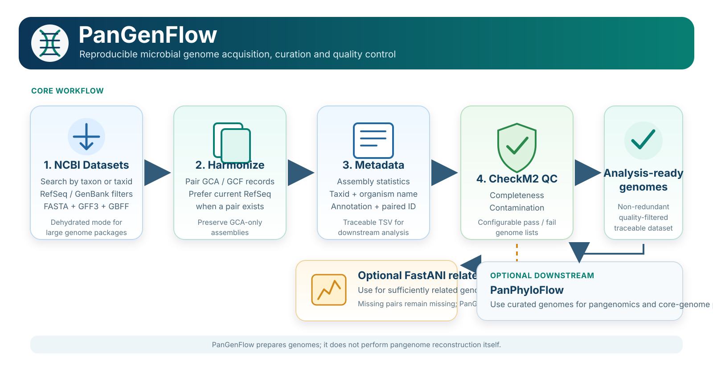

# PanGenFlow

[](https://github.com/mbilal-OU/PanGenFlow/actions/workflows/test.yml)
[](https://github.com/mbilal-OU/PanGenFlow/actions/workflows/docs.yml)
[](LICENSE)
[]()

**PanGenFlow** is a reproducible toolkit for building analysis-ready microbial genome cohorts from NCBI.

> **From taxon query to a traceable, GCA/GCF-reconciled, quality-filtered genome collection.**

<p align="center">
  
</p>

**Docs:** [start here](docs/index.md) · **FastANI scope:** [when ANI is appropriate](docs/fastani_scope.md) · **Cheatsheet:** [commands only](docs/cheatsheet.md)

---

## At a glance

PanGenFlow is designed for the **data-preparation layer** of microbial comparative genomics. It helps you retrieve genomes, reconcile paired NCBI assembly records, extract assembly metadata, apply explicit quality filters, and optionally inspect close-genome relatedness.

It deliberately stops **before** pangenome reconstruction, phylogenomics, AMR analysis, BGC analysis, or other downstream biology.

| You provide | PanGenFlow returns |
|---|---|
| NCBI taxon name or taxid | downloaded NCBI data package |
| assembly-source / level filters | explicit record of what was requested |
| GCA/GCF-containing data directory | reconciled genome list with RefSeq preference where paired |
| NCBI assembly report | flat metadata table |
| QC thresholds | passed and failed genome lists |
| optional close-genome set | FastANI pair table, matrix, summary and heatmap |

---

## The curation path

### 1. Acquire

Download genomes with explicit NCBI Datasets filters.

```bash
bash scripts/batch_download.sh "Deinococcus" genomes/
```

For large collections:

```bash
bash scripts/batch_download.sh "Deinococcota" genomes/ \
  --dehydrated \
  --workers 12
```

Useful switches:

```text
--source RefSeq|GenBank|all
--level complete|chromosome|scaffold|contig
--include genome,gff3,gbff,seq-report
--dehydrated
--workers 1-30
```

### 2. Reconcile paired GCA/GCF assembly records

```bash
python scripts/deduplicate_genomes.py \
  genomes/ncbi_dataset/data \
  genome_list_clean.txt
```

This step performs **accession reconciliation**, not biological dereplication. When paired GenBank/RefSeq representations of the same assembly family are present, PanGenFlow prefers the highest available GCF version; GCA-only assemblies are retained.

The script keeps its historical filename, `deduplicate_genomes.py`, for backward compatibility.

### 3. Capture assembly metadata

```bash
python scripts/extract_metadata.py \
  genomes/ncbi_dataset/data/assembly_data_report.jsonl \
  metadata_table.tsv
```

The table includes fields available from the NCBI genome assembly report, such as accession, paired accession, source database, organism name, taxid, assembly level, assembly statistics, annotation counts, and NCBI-supplied quality/ANI status when present.

PanGenFlow does **not** invent full lineage fields that are absent from the assembly report. Use NCBI taxonomy data when you need family/order/phylum lineage.

### 4. Apply genome-quality criteria

```bash
conda activate checkm2

bash scripts/run_checkm2.sh \
  genome_list_clean.txt \
  checkm2_results/ \
  ~/checkm2_db/CheckM2_database/uniref100.KO.1.dmnd \
  8 \
  90 \
  5
```

The last two values are:

```text
minimum completeness
maximum contamination
```

For a stricter cohort, for example:

```bash
bash scripts/run_checkm2.sh genome_list_clean.txt checkm2_results/ "$CHECKM2DB" 8 95 5
```

Genome files are staged with **symlinks rather than copied**, so large collections do not unnecessarily double disk use.

### Optional: Inspect close-genome relatedness with FastANI

Use this only when the collection is sufficiently related for FastANI to be informative.

```bash
conda activate pangenflow

bash scripts/run_fastani.sh \
  checkm2_results/genome_list_qc_passed.txt \
  fastani_results/ \
  8
```

Unreported FastANI comparisons remain `NA`; PanGenFlow does not replace them with invented low ANI values.

---

## Decision points you should choose deliberately

| Decision | Typical options | Why it matters |
|---|---|---|
| NCBI source | RefSeq / GenBank / all | changes which assembly records are available |
| assembly level | complete / chromosome / scaffold / contig | changes continuity and cohort size |
| atypical assemblies | excluded by default | removes assemblies NCBI flags as atypical |
| completeness threshold | e.g. 90% or 95% | stricter thresholds reduce missing genomic content |
| contamination threshold | e.g. 5% | limits mixed or contaminated assemblies |
| FastANI use | optional | meaningful only for sufficiently related genomes |

PanGenFlow records the cohort you create; it does not decide what thresholds are biologically correct for every project.

---

## Three common recipes

### Species-level reference set

```bash
bash scripts/batch_download.sh "Thermus thermophilus" thermus/ \
  --source RefSeq \
  --level complete,chromosome

python scripts/deduplicate_genomes.py thermus/ncbi_dataset/data thermus_clean.txt
python scripts/extract_metadata.py thermus/ncbi_dataset/data/assembly_data_report.jsonl thermus_metadata.tsv
```

Then run CheckM2 and, if appropriate, FastANI.

### Broad taxonomic collection

```bash
bash scripts/batch_download.sh "Deinococcota" deinococcota/ \
  --source RefSeq \
  --level complete \
  --dehydrated \
  --workers 16
```

For a broad phylum-level collection, **do not make all-vs-all FastANI a required filtering step**. Use QC and metadata first, then choose a relatedness method appropriate for your biological question.

### RefSeq + GenBank retrieval

```bash
bash scripts/batch_download.sh "Deinococcus" deinococcus_all/ \
  --source all \
  --level complete,chromosome

python scripts/deduplicate_genomes.py \
  deinococcus_all/ncbi_dataset/data \
  deinococcus_reconciled.txt
```

This is the use case where GCA/GCF reconciliation is most relevant.

---

## Files worth keeping

```text
project/
├── genome_list_clean.txt
├── metadata_table.tsv
├── genomes/
│   └── ncbi_dataset/
│       └── data/
├── checkm2_results/
│   ├── quality_report.tsv
│   ├── quality_report_with_paths.tsv
│   ├── input_mapping.tsv
│   ├── genome_list_qc_passed.txt
│   └── genome_list_qc_failed.txt
└── fastani_results/                  # optional
    ├── fastani_results.tsv
    ├── fastani_pairs.tsv
    ├── ani_matrix.tsv
    ├── ani_summary.tsv
    └── figures/
```

The most useful handoff file for downstream analysis is usually:

```text
checkm2_results/genome_list_qc_passed.txt
```

---

## What each script is responsible for

| Script | Responsibility |
|---|---|
| `batch_download.sh` | NCBI retrieval and large-package rehydration |
| `deduplicate_genomes.py` | GCA/GCF assembly-record reconciliation |
| `extract_metadata.py` | NCBI assembly-report flattening |
| `run_checkm2.sh` | quality assessment and pass/fail genome lists |
| `run_fastani.sh` | optional close-genome ANI summary and visualization |

---

## Scope and guardrails

**PanGenFlow does:**

- make NCBI retrieval parameters explicit;
- reconcile paired GCA/GCF assembly records;
- preserve GCA-only assemblies when appropriate;
- expose assembly metadata;
- apply configurable CheckM2 thresholds;
- preserve missing FastANI comparisons as missing.

**PanGenFlow does not:**

- biologically dereplicate strains merely because they are similar;
- treat ANI as a universal contamination detector;
- assume FastANI is appropriate across deep taxonomic distances;
- infer taxonomy that is not present in the source report;
- perform pangenome reconstruction.

---

## Installation

Core environment:

```bash
git clone https://github.com/mbilal-OU/PanGenFlow.git
cd PanGenFlow
conda env create -f environment.yml
conda activate pangenflow
```

CheckM2 is best kept in its own environment:

```bash
mamba create -n checkm2 -c bioconda -c conda-forge checkm2
conda activate checkm2
checkm2 database --download --path ~/checkm2_db/
checkm2 testrun
```

---

## Downstream handoff

PanGenFlow is intentionally downstream-agnostic. Its curated genome list can feed any genome-analysis workflow.

If the next question is specifically **microbial pangenomics and core-genome phylogenomics**, the separate [PanPhyloFlow](https://github.com/mbilal-OU/PanPhyloFlow) project is one optional destination.

```text
PanGenFlow output
      │
      ├──► PanPhyloFlow
      ├──► custom phylogenomics
      ├──► AMR / virulence workflows
      └──► other comparative-genomics analyses
```

---

## Validation

GitHub Actions currently checks Python unit tests, Python syntax and shell syntax. External tools such as NCBI Datasets, CheckM2 and FastANI are not replaced by mock biological validation; a separate real-data validation issue tracks the live-tool layer.

See [`tests/`](tests/) and the repository issues for the current validation status.

## Documentation

- [Documentation home](docs/index.md)
- [Workflow details](docs/workflow.md)
- [When to use FastANI](docs/fastani_scope.md)
- [Command cheatsheet](docs/cheatsheet.md)

## Citation

Citation metadata for PanGenFlow are provided in [`CITATION.cff`](CITATION.cff). Please also cite the external software used in your analysis, especially NCBI Datasets, CheckM2 and FastANI.

## License

MIT. See [`LICENSE`](LICENSE).
